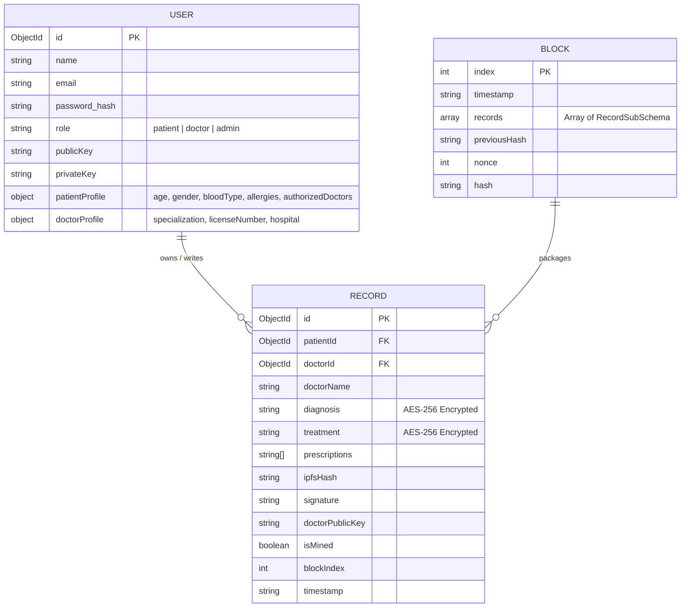
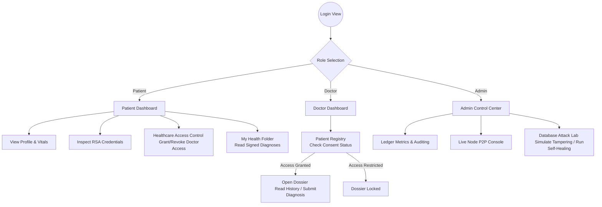

# System Architecture, Requirements, and Database Specification
**Institution:** Zetech University — Faculty of Computing and Information Technology  
**Research Title:** Decentralized Cryptographic Electronic Health Records Ledger for Low-Resource Environments  
**System Specification Document: Responsive Web Application**  

---

## 1. System Architecture

The system is structured as a responsive, multi-portal **React Web Application** running on a lightweight **Vite** frontend platform, communicating via HTTPS with a **Node.js/Express** backend API layer. Data storage is split between a secure **MongoDB** database for transaction records and an in-memory **Blockchain Ledger Engine** that implements consensus rules, cryptographic linkage, and proof-of-work mining.

### Architecture Topology Diagram
```mermaid
graph TD
    subgraph Client Layer (Responsive Web UI)
        ReactWeb["Vite React Web App (Desktop/Mobile Browsers)"]
        RSAKeyPair["Client-Side Key Generator (RSA-2048)"]
        CryptoSign["Client-Side Signature Solver (SHA-256)"]
    end
    
    subgraph Application Layer (Node.js API Server)
        ExpressAPI["Express.js Server (Port 5000)"]
        BlockchainEngine["In-Memory Ledger Engine"]
    end
    
    subgraph Data & Storage Layer
        MongoDb[("MongoDB Database<br/>(AES-256 Encrypted-at-Rest)")]
        IPFSSim["Mock IPFS Gateway<br/>(Off-Chain Scan Attachments)"]
    end

    ReactWeb -->|HTTPS API Requests| ExpressAPI
    ExpressAPI -->|Read/Write Encrypted Records| MongoDb
    ExpressAPI -->|Sync Block Data| BlockchainEngine
    ReactWeb -.->|References CIDs| IPFSSim
```

### Components Interaction Flow
1. **Frontend Web UI**: Built as a responsive interface using pure HTML, JavaScript, and React. It dynamically adapts to mobile screens, tablets, and desktops using flexible media queries.
2. **Client-Side Cryptographic Handlers**: Performs browser-based RSA key generation. Digital signatures of medical records are simulated and verified using doctor public keys.
3. **Application Server**: Coordinates Express.js routing, handles authentication token issuance, routes queries to the database, and exposes blockchain consensus modules.
4. **Database (AES-256)**: Performs automatic encryption of sensitive diagnoses and treatment plans at rest using AES-256-CBC field level hooks.
5. **Ledger Engine (Mempool & Proof of Work)**: Aggregates signed medical transactions in a mempool, mines blocks using SHA-256 hashes with custom difficulty constraints, and validates chain hashes recursively.

---

## 2. System Requirements

### 2.1 Functional Requirements
* **FR1: Multi-Portal Authentication**: Users must be able to log in or register under three distinct roles: Patients, Healthcare Providers (Doctors), and Network Administrators.
* **FR2: Cryptographic Identity Generation**: Registration of any clinical operator or patient must automatically trigger RSA-2048 public/private key pair generation.
* **FR3: Patient-Controlled Access Control (Consent Registry)**:
  * Patients must be able to view registered doctors and grant or revoke access permissions.
  * Doctors must only be allowed to view dossiers or write clinical logs for patients who have granted them active consent.
* **FR4: Field-Level Data Encryption**: Sensitive clinical data (diagnoses and treatment plans) must be encrypted at rest in MongoDB.
* **FR5: Digital Record Signing**: Doctor profiles must cryptographically sign records using their private keys upon submission.
* **FR6: Proof-of-Work Blockchain Mining**: Mempool records must be mined into a block using proof-of-work validations.
* **FR7: Integrity Auditing & Self-Healing**:
  * Administrators must have access to a Security Lab to view validation logs and simulate raw database tampering.
  * The system must offer a self-healing mechanism that automatically recovers MongoDB records using valid blockchain ledger logs.

### 2.2 Non-Functional Requirements
* **NFR1: Responsiveness**: The web application must render adaptively on mobile phones, tablets, and desktops without layout breaks.
* **NFR2: Low-Resource Compatibility**: The frontend must load efficiently over poor connections and run inside basic web browsers.
* **NFR3: Portability**: The system must run portably on Windows development systems using local binaries without requiring global software installations.
* **NFR4: Performance**: Block mining under simple difficulty settings must resolve in milliseconds to support instant laboratory audits.

---

## 3. Database Design

The schema structure uses MongoDB as the primary backend database. It consists of three main collections: `User`, `Record`, and `Block`.

### Entity Relationship Model (ERD)


### MongoDB Collection Specifications

#### Collection 1: `users`
* Stores user credentials, profiles, cryptographic identity keys, and access consent states.
* **Schema Definition**:
```json
{
  "_id": "ObjectId",
  "name": "String (Required)",
  "email": "String (Required, Unique, Lowercase)",
  "password": "String (Required, Bcrypt Hash)",
  "role": "String (Enum: ['patient', 'doctor', 'admin'])",
  "publicKey": "String (PEM format, RSA-2048)",
  "privateKey": "String (PEM format, RSA-2048)",
  "patientProfile": {
    "age": "Number",
    "gender": "String",
    "bloodType": "String",
    "allergies": ["String"],
    "emergencyContact": "String",
    "authorizedDoctors": ["ObjectId (Ref: User)"] // Consent registry list
  },
  "doctorProfile": {
    "specialization": "String",
    "licenseNumber": "String",
    "hospital": "String"
  },
  "createdAt": "Date"
}
```

#### Collection 2: `records`
* Stores clinical records. Sensitive text is encrypted at rest using AES-256-CBC and decrypted automatically upon database fetch.
* **Schema Definition**:
```json
{
  "_id": "ObjectId",
  "patientId": "ObjectId (Ref: User, Required)",
  "doctorId": "ObjectId (Ref: User, Required)",
  "doctorName": "String (Required)",
  "diagnosis": "String (AES-256 Encrypted, Required)",
  "treatment": "String (AES-256 Encrypted, Required)",
  "prescriptions": ["String"],
  "ipfsHash": "String (Default: '')",
  "signature": "String (Hex, SHA256-RSA, Required)",
  "doctorPublicKey": "String (PEM format, Required)",
  "isMined": "Boolean (Default: false)",
  "blockIndex": "Number (Default: -1)",
  "timestamp": "String (Required)"
}
```

#### Collection 3: `blocks`
* Stores mined ledger blocks, establishing immutable cryptographic links between blocks.
* **Schema Definition**:
```json
{
  "_id": "ObjectId",
  "index": "Number (Required, Unique)",
  "timestamp": "String (Required)",
  "records": [
    {
      "recordId": "String",
      "patientId": "String",
      "patientName": "String",
      "doctorId": "String",
      "doctorName": "String",
      "diagnosis": "String (Decrypted record text)",
      "treatment": "String",
      "prescriptions": ["String"],
      "ipfsHash": "String",
      "signature": "String",
      "doctorPublicKey": "String",
      "timestamp": "String",
      "message": "String (Used in Genesis block)",
      "doctor": "String (Used in Genesis block)"
    }
  ],
  "previousHash": "String (Required)",
  "nonce": "Number (Required)",
  "hash": "String (SHA-256, Required, Unique)"
}
```

---

## 4. User Interface Architecture

The UI is built as a responsive single-page web dashboard that handles route transitions using React state hooks. Layout views adapt cleanly to varying viewport sizes.

### UI Portal Flowchart


### Responsive Design Patterns
* **Grid Layouts**: The dashboard views utilize `.grid-2` and `.grid-3` structures built in CSS. These automatically collapse to single-column structures on viewport widths below `1024px` to fit screens of mobile phones and smaller tablet profiles.
* **Glassmorphism Theme**: Custom translucent overlays (`var(--glass-bg)`, `backdrop-filter: blur(16px)`) provide a premium interface feel across both desktop and mobile web viewports.
* **Interactive Toggles**: Consent actions are represented as toggle buttons displaying real-time state changes without needing desktop refreshes.

---

## 5. Web Implementation & Verification Plan

### 5.1 Deployment Stack
* **Vite React Frontend**: Runs locally on `http://localhost:3000`. Exposes proxy settings to route API data to port 5000.
* **Express.js API Backend**: Runs locally on `http://localhost:5000`.
* **MongoDB Database**: Runs locally on `mongodb://127.0.0.1:27017/blockchain_health`.

### 5.2 Verification Scenarios (Web Tests)
1. **Verification Scenario A: Enforcing Patient Consent Controls**
   * Register a Patient and Doctor.
   * Log in as the Doctor, view the dashboard registry, and verify the patient card exhibits an **Access Restricted** lock status. Try clicking "Open Records" and ensure it is disabled.
   * Log in as the Patient, go to **Healthcare Access & Consent Control**, and click **Grant Access** for the doctor.
   * Log back in as the Doctor, confirm the patient shows **Access Granted**, open the folder, and submit a medical record.
2. **Verification Scenario B: Ledger Verification Audit & Database Recovery**
   * Go to the **Admin Command Center** (or **Ledger Explorer**).
   * Confirm the Network Status banner displays **SECURE**.
   * Run the **Security Lab** simulator: pick a record, type modified diagnosis text, and select **Force Database Edit**.
   * Verify that the network status banner immediately alerts **COMPROMISED (TAMPER DETECTED)** and turns the tampered ledger block **Red**.
   * Click **Recover from Ledger** and check if the database values are automatically healed and ledger state returned to **SECURE**.
