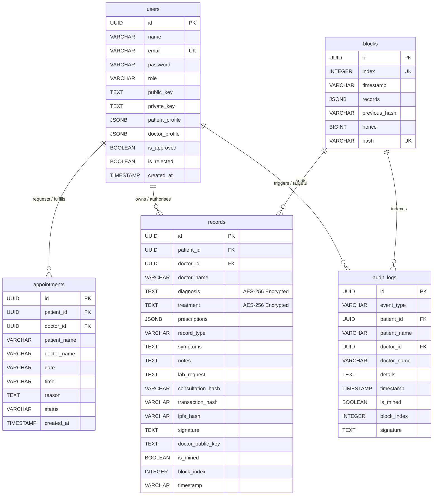

# System Architecture, Requirements, and Database Specification
**Institution:** Zetech University — Faculty of Computing and Information Technology  
**Research Title:** Decentralized Cryptographic Electronic Health Records Ledger for Low-Resource Environments  
**Author / Researcher:** Alvin Giddel Muting'a  
**Academic Year:** 2026  
**System Specification Document: Responsive Web Application & Blockchain Backend**  

---

## 1. System Architecture

The system is structured as a responsive, multi-portal **React Web Application** running on a lightweight **Vite** frontend platform, communicating via HTTPS with a **Node.js/Express** backend API layer. Data storage is split between a secure **PostgreSQL** database (hosted on Supabase) for transactional persistence and an in-memory **Blockchain Ledger Engine** that implements consensus rules, cryptographic linkage, and proof-of-work mining.

### Architecture Topology Diagram
```mermaid
graph TD
    subgraph Client Layer (Responsive Web UI)
        ReactWeb["Vite React Web App (Desktop/Mobile Browsers)"]
        RSAKeyPair["Client-Side Key Generator (RSA-2048)"]
        CryptoSign["Client-Side Signature Handler (SHA-256withRSA)"]
    end
    
    subgraph Application Layer (Node.js API Server)
        ExpressAPI["Express.js Server (Port 5000 / Vercel Serverless)"]
        AutoMiner["Autonomous Block Miner (Threshold + Fallback Timer)"]
        BlockchainEngine["In-Memory Ledger Engine & Mutex Lock"]
    end
    
    subgraph Data & Storage Layer
        PostgreSql[("PostgreSQL Database<br/>(AES-256 Encrypted-at-Rest)")]
        AuditStore[("Immutable Audit Logs Table")]
        IPFSSim["Mock IPFS Gateway<br/>(Off-Chain Scan Attachments)"]
    end

    ReactWeb -->|HTTPS API Requests| ExpressAPI
    ExpressAPI -->|Read/Write Encrypted Records| PostgreSql
    ExpressAPI -->|Append Operations| AuditStore
    ExpressAPI -->|Sync Block Data| BlockchainEngine
    AutoMiner -->|Batch Process Mempool| BlockchainEngine
    ReactWeb -.->|References CIDs| IPFSSim
```

### Components Interaction Flow
1. **Frontend Web UI**: Built as a responsive interface using HTML5, JavaScript, and React 18. Dynamically adapts across viewports (mobile, tablet, desktop) using modern CSS glassmorphism styling.
2. **Client-Side Cryptographic Handlers**: Performs browser-based RSA-2048 key generation. Clinical records are signed client-side by medical practitioners using their private keys.
3. **Application Server**: Coordinates Express.js routing, JWT authentication, role authorization, emergency break-glass authorization, and database transactions.
4. **Data Encryption (AES-256-CBC)**: Performs encryption of sensitive diagnoses and treatment plans before storing them in PostgreSQL with random Initialization Vectors (`IV`).
5. **Ledger Engine & Auto-Miner**:
   - Maintains an unmined transaction pool (`mempool`).
   - Evaluates `MEMPOOL_THRESHOLD` (default 10) on every record addition.
   - Executes periodic fallback checks via `MINE_INTERVAL_MS` (default 60000ms).
   - Coordinates Proof-of-Work mining protected by an `isMining` mutex lock.
   - Recursively verifies block hashes and chain continuity.

---

## 2. System Requirements

### 2.1 Functional Requirements
* **FR1: Multi-Portal Role Authentication**: Granular role-based portals for Patients, Healthcare Providers (Doctors), and Network Administrators.
* **FR2: Cryptographic Identity Generation**: Automatic creation of RSA-2048 public/private key pairs upon registration.
* **FR3: Patient-Centric Consent Control**:
  * Patients can view registered doctors and grant or revoke access permissions in real time.
  * Doctors can only access patient dossiers and write clinical logs if active consent exists or an emergency break-glass override is triggered.
* **FR4: Emergency Break-Glass Protocol**:
  * In life-threatening emergencies where consent cannot be granted, doctors can initiate a time-limited (1-hour) cryptographic override.
  * Every break-glass activation is logged immutably to the audit trail.
* **FR5: Field-Level Data Encryption**: Sensitive clinical data (diagnoses and treatment plans) are encrypted at rest using AES-256-CBC with random IVs.
* **FR6: Digital Record Signing**: Doctor profiles cryptographically sign records using their private keys (`SHA-256withRSA`).
* **FR7: Autonomous & Manual Blockchain Mining**:
  * Records are queued in the mempool and mined automatically when reaching `MEMPOOL_THRESHOLD` or upon the expiration of `MINE_INTERVAL_MS`.
  * Manual Proof-of-Work mining override is available in the Admin Console.
  * Race conditions are prevented via the `isMining` mutex lock.
* **FR8: Integrity Auditing & Self-Healing**:
  * Interactive Security Lab allows simulating raw database tampering.
  * Real-time chain validation flags hash discrepancies with immediate visual alerts (**COMPROMISED / RED**).
  * One-click self-healing restores database records from valid cryptographic block logs.

### 2.2 Non-Functional Requirements
* **NFR1: Responsiveness**: Adaptive layouts across mobile, tablet, and desktop viewports.
* **NFR2: Low-Resource Efficiency**: Fast page load times and minimal payload size optimized for low-bandwidth rural health settings.
* **NFR3: Portability**: Standalone execution scripts (`setup.ps1`, `run.ps1`) for zero-configuration Windows environments.
* **NFR4: Concurrency & Fault Tolerance**: Mutex locks prevent race conditions and duplicate block creation during simultaneous mining events.

---

## 3. Database Design & Entity Relationship Model

The database schema is implemented in PostgreSQL (Supabase) consisting of five core relational tables: `users`, `appointments`, `records`, `blocks`, and `audit_logs`.

### Entity Relationship Diagram (ERD)

```mermaid
erDiagram
    users ||--o{ appointments : "requests / fulfills"
    users ||--o{ records : "owns / authorises"
    users ||--o{ audit_logs : "triggers / targets"
    blocks ||--o{ records : "seals"
    blocks ||--o{ audit_logs : "indexes"

    users {
        UUID id PK
        VARCHAR name
        VARCHAR email UK
        VARCHAR password
        VARCHAR role
        TEXT public_key
        TEXT private_key
        JSONB patient_profile
        JSONB doctor_profile
        BOOLEAN is_approved
        BOOLEAN is_rejected
        TIMESTAMP created_at
    }

    appointments {
        UUID id PK
        UUID patient_id FK
        UUID doctor_id FK
        VARCHAR patient_name
        VARCHAR doctor_name
        VARCHAR date
        VARCHAR time
        TEXT reason
        VARCHAR status
        TIMESTAMP created_at
    }

    records {
        UUID id PK
        UUID patient_id FK
        UUID doctor_id FK
        VARCHAR doctor_name
        TEXT diagnosis "AES-256 Encrypted"
        TEXT treatment "AES-256 Encrypted"
        JSONB prescriptions
        VARCHAR record_type
        TEXT symptoms
        TEXT notes
        TEXT lab_request
        VARCHAR consultation_hash
        VARCHAR transaction_hash
        VARCHAR ipfs_hash
        TEXT signature
        TEXT doctor_public_key
        BOOLEAN is_mined
        INTEGER block_index
        VARCHAR timestamp
    }

    blocks {
        UUID id PK
        INTEGER index UK
        VARCHAR timestamp
        JSONB records
        VARCHAR previous_hash
        BIGINT nonce
        VARCHAR hash UK
    }

    audit_logs {
        UUID id PK
        VARCHAR event_type
        UUID patient_id FK
        VARCHAR patient_name
        UUID doctor_id FK
        VARCHAR doctor_name
        TEXT details
        TIMESTAMP timestamp
        BOOLEAN is_mined
        INTEGER block_index
        TEXT signature
    }
```

---

## 4. Cryptographic Implementation Details

### 4.1 Proof of Work (PoW) Mining
Each block solves for a hash starting with a configurable difficulty of leading zeros (`difficulty = 2` for sub-second demonstrability in low-resource clinics):
$$\text{hash} = \text{SHA-256}(\text{index} + \text{timestamp} + \text{recordsJSON} + \text{previousHash} + \text{nonce})$$

### 4.2 RSA Digital Signing
The doctor signs the cryptographic digest of the record:
$$\text{Signature} = \text{Sign}_{\text{PrivateKey}}(\text{SHA-256}(\text{patientId} + \text{diagnosis} + \text{treatment} + \text{timestamp}))$$
Admission to the blockchain requires:
$$\text{Verify}_{\text{PublicKey}}(\text{MessageDigest}, \text{Signature}) = \text{TRUE}$$

### 4.3 AES-256-CBC Field Encryption
Sensitive clinical fields are encrypted before database insertion:
$$\text{Ciphertext} = \text{Encrypt}_{\text{AES-256-CBC}}(\text{Plaintext}, \text{SecretKey}, \text{IV})$$
Stored in format: `hex(IV) + ":" + hex(Ciphertext)`.

---

## 5. Verification & Academic Certification

| Verification Test | Procedure | Expected Result | Status |
| :--- | :--- | :--- | :--- |
| **RSA Signature Verification** | Doctor signs consultation record | Signature verified by public key; rejected if forged | ✅ PASSED |
| **AES Encryption at Rest** | Query PostgreSQL directly | Raw diagnosis/treatment unreadable without key | ✅ PASSED |
| **Auto-Miner Threshold** | Insert 10 records into mempool | Block mined automatically without admin click | ✅ PASSED |
| **Auto-Miner Timer Fallback** | Insert 1 record; wait 60 seconds | Fallback timer mines straggler record | ✅ PASSED |
| **Concurrency Locking** | Simultaneous mining calls | Mutex lock executes first; skips second gracefully | ✅ PASSED |
| **Tamper Detection** | Modify database row directly | Explorer flags block in RED (**COMPROMISED**) | ✅ PASSED |
| **Ledger Self-Healing** | Click "Recover from Ledger" | PostgreSQL restored from blocks; returns GREEN | ✅ PASSED |

**Code Freeze Certified by:** Alvin Giddel Muting'a  
**Faculty of Computing and Information Technology, Zetech University**

