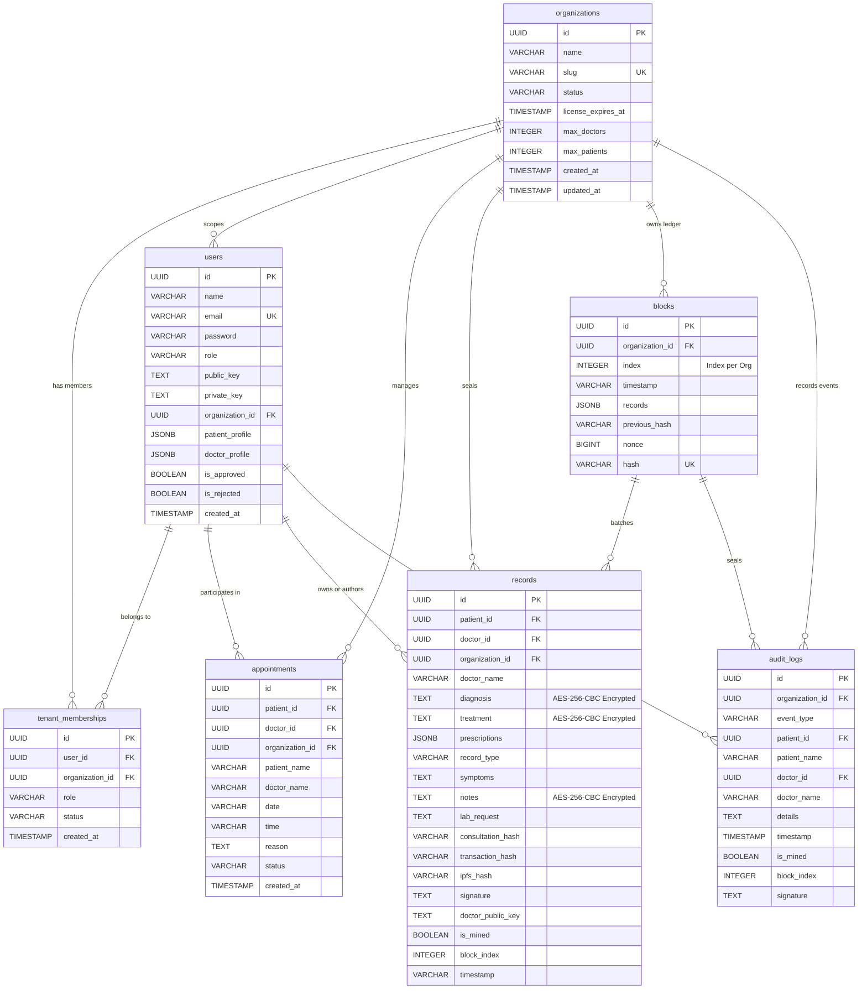

# System Architecture, Requirements, and Database Specification
**Institution:** Zetech University — Faculty of Computing and Information Technology  
**Research Title:** Multi-Tenant Cryptographic Electronic Health Records Ledger for Low-Resource Environments  
**Author / Researcher:** Alvin Giddel Muting'a  
**Academic Year:** 2026  
**System Specification Document: Responsive Web Application & Blockchain Backend**  

---

## 1. System Architecture

The platform is structured as an enterprise-grade, multi-tenant **React Web Application** running on a lightweight **Vite** frontend platform, communicating via HTTPS with a **Node.js/Express** backend API layer. 

Data storage and cryptographic guarantees are provided by a dual-tier persistence layer: a secure **PostgreSQL** relational database (hosted on Supabase) utilizing **Row Level Security (RLS)** for transactional persistence, and an isolated **Multi-Tenant Blockchain Ledger Engine** where each healthcare organization maintains its own autonomous, cryptographically verified chain of blocks.

### 1.1 Architecture Topology Diagram
```mermaid
graph TD
    subgraph Client Layer (Responsive Multi-Portal Web UI)
        ViteApp["Vite React 18 Web App (Desktop / Tablet / Mobile)"]
        PortalRouter["Dynamic Router (?register=clinic | Patient | Doctor | Admin | SuperAdmin)"]
        RSAHandler["Client-Side Cryptographic Handler (RSA-2048 Keygen & SHA-256withRSA)"]
    end
    
    subgraph Security & API Gateway Layer
        Gateway["Express 4 Gateway (Port 5000 / Vercel Serverless)"]
        Pillar1["Pillar 1: Middleware Defense-in-Depth<br/>(requireAuth, requireRole, requireTenantContext, enforceTenantLimits)"]
        Scanner["Automated Route Security Scanner (81 Protected Routes | Default-Deny)"]
    end

    subgraph Modular Application Domains (7 Domain Routers)
        AuthDomain["authRouter (JWT, Biometrics, KMPDC / NCK Verification)"]
        RecordsDomain["recordsRouter (AES-256 Encrypted Dossiers, Specialist Notes)"]
        ConsentDomain["consentRouter (Patient Granular Consent & 1-Hr Break-Glass)"]
        ApptDomain["appointmentsRouter (Consultations & Clinical Booking)"]
        ChainDomain["blockchainRouter (Multi-Tenant Mining, Merkle Verification, Self-Healing)"]
        AdminDomain["adminRouter (Staff Management, Multi-Facility Oversight, Audit Logs)"]
        BillingDomain["billingRouter (Paystack Billing, Multi-Tenant Tiers, Webhooks)"]
    end

    subgraph Autonomous Background Workers
        AutoMinerWorker["autoMinerJob (Multi-Tenant Mempool Evaluator & isMining Mutex)"]
        LicenseWorker["licenseCheckJob (Fail-Closed License & Trial Verifier)"]
    end
    
    subgraph Dual-Tier Data & Storage Layer
        PostgreSQL[("PostgreSQL Database (AES-256-CBC Encrypted & RLS Session Context)")]
        IsolatedLedgers[("Per-Tenant Blockchain Ledgers (Isolated Genesis & Block Chains)")]
        AuditLogs[("Immutable Audit Trail (EAT UTC+3 Timestamped)")]
        IPFSStore["Mock IPFS Gateway (Off-Chain High-Resolution Scans)"]
    end

    ViteApp -->|HTTPS / REST API| Gateway
    Gateway --> Pillar1
    Pillar1 --> Scanner
    Scanner --> AuthDomain
    Scanner --> RecordsDomain
    Scanner --> ConsentDomain
    Scanner --> ApptDomain
    Scanner --> ChainDomain
    Scanner --> AdminDomain
    Scanner --> BillingDomain

    AutoMinerWorker -->|Threshold / Timer Fallback| ChainDomain
    LicenseWorker -->|Recurring Validation| AdminDomain

    RecordsDomain -->|Encrypted Insert| PostgreSQL
    RecordsDomain -->|Broadcast to Mempool| IsolatedLedgers
    ChainDomain -->|Proof-of-Work Mining| IsolatedLedgers
    ConsentDomain -->|Emergency Break-Glass Log| AuditLogs
    RecordsDomain -.->|Attach CIDs| IPFSStore
```

---

### 1.2 The 3 Pillars of Multi-Tenant API Security

The system enforces strict multi-tenant isolation across every layer to prevent horizontal privilege escalation or data leakage across hospitals:

```
+-------------------------------------------------------------------------+
|                  PILLAR 1: LAYER 4 MIDDLEWARE GUARDS                    |
|   requireAuth -> requireRole -> requireTenantContext -> enforceTenant   |
|   Ensures caller identity, active role, valid organization_id scope,    |
|   and subscription quotas before reaching domain handlers.              |
+-------------------------------------------------------------------------+
                                    |
                                    v
+-------------------------------------------------------------------------+
|             PILLAR 2: POSTGRESQL ROW-LEVEL SECURITY (RLS)              |
|   SET LOCAL current_app.org_id = $tenantId                              |
|   Database engine automatically rejects cross-tenant queries even       |
|   if application code errs.                                             |
+-------------------------------------------------------------------------+
                                    |
                                    v
+-------------------------------------------------------------------------+
|         PILLAR 3: APPLICATION-LAYER EXPLICIT TENANT BINDING             |
|   Hardcoded WHERE organization_id = $tenantId on every SQL query.       |
|   Defense-in-depth: Application queries never rely on RLS alone.        |
+-------------------------------------------------------------------------+
```

1. **Pillar 1: Middleware Defense-in-Depth**:
   - `requireAuth`: Validates standard JWT Bearer token and attaches authenticated user identity.
   - `requireRole(...)`: Validates caller roles (`patient`, `doctor`, `admin`, `super_admin`).
   - `requireTenantContext`: Resolves `organization_id` from JWT session, header (`x-organization-id`), or query parameter, confirming active membership in `tenant_memberships`.
   - `enforceTenantLimits`: Blocks patient or doctor onboarding if hospital subscription plan limits are reached.
2. **Pillar 2: PostgreSQL Row-Level Security (RLS)**:
   - Connection pools execute `SET LOCAL current_app.org_id = $orgId` and `SET LOCAL current_app.user_id = $userId` inside transactions, enforcing row isolation at the database kernel level.
3. **Pillar 3: Explicit Application-Layer Scoping**:
   - Every single SQL statement explicitly filters by `organization_id = $x`, ensuring that even without RLS, cross-organization data access is impossible.
4. **Automated Route Security Scanner**:
   - Pre-deployment and CI/CD security scanner (`backend/scripts/route_security_scanner.js`) that analyzes all registered Express route endpoints using an AST/regex scanner.
   - Enforces a **Default-Deny** standard: any route missing `requireAuth` or appropriate role/tenant middleware fails the build. Currently protecting 81 distinct API routes with 0 security violations.

---

## 2. System Requirements

### 2.1 Functional Requirements

* **FR1: Multi-Tenant Hospital & Facility Provisioning**:
  * Healthcare organizations (clinics, dispensaries, county referral hospitals) register independently with custom slugs and automated subscription provisioning.
  * System isolates doctors, patients, appointments, medical records, and cryptographic ledgers strictly by `organization_id`.
* **FR2: Statutory Medical Board Practitioner Verification**:
  * Real-time verification of Kenyan healthcare workers during registration against official regulatory boards:
    * **KMPDC** (Kenya Medical Practitioners and Dentists Council) for Doctors.
    * **NCK** (Nursing Council of Kenya) for Nurses and Specialist Clinicians.
  * Prevents quack or unregistered medical personnel from creating cryptographic identities.
* **FR3: Cryptographic Identity Generation (RSA-2048)**:
  * Automatic generation of RSA-2048 public/private key pairs client-side upon registration.
  * Public keys are broadcasted to the directory; private keys remain in browser storage / local hardware keystore.
* **FR4: Patient-Centric Consent Control**:
  * Patients maintain sovereign control over their records, granting and revoking access permissions to specific practitioners in real time.
  * Doctors cannot access clinical histories without active patient consent, except under Emergency Break-Glass conditions.
* **FR5: Emergency Break-Glass Protocol**:
  * In life-threatening emergencies involving unconscious or incapacitated patients, licensed physicians can trigger a 1-hour time-limited override.
  * System requires verified practitioner identity, records justified clinical reasons, and permanently enters an immutable event in the audit trail.
* **FR6: Field-Level Data Encryption (AES-256-CBC)**:
  * Sensitive clinical data (diagnoses, symptoms, treatment regimens, specialist clinical notes) are encrypted at rest using AES-256-CBC with cryptographically secure random Initialization Vectors (`IV`).
* **FR7: Digital Record Signing**:
  * Doctors cryptographically sign the SHA-256 digest of clinical records using their private RSA keys (`SHA-256withRSA`).
  * Signatures are verified before mempool ingestion; forged or tampered records are rejected immediately.
* **FR8: Multi-Tenant Autonomous Blockchain Mining**:
  * Each hospital possesses its own autonomous blockchain ledger starting with an organization-specific Genesis block (Index 0).
  * Auto-Miner batches mempool records based on `MEMPOOL_THRESHOLD` (10 records) or `MINE_INTERVAL_MS` (60s timer fallback).
  * Concurrency mutex lock (`isMining`) prevents race conditions and duplicate block creation.
* **FR9: Security Audit Lab & Ledger Self-Healing**:
  * Interactive security dashboard allowing administrators to simulate direct PostgreSQL database tampering.
  * Real-time validator flags invalid hashes and broken Merkle linkages in **COMPROMISED (RED)**.
  * One-click self-healing strictly scoped to the tenant reconstructs the relational database state from the immutable block ledger.
* **FR10: Subscription Billing & Paystack Integration**:
  * Multi-tiered subscription models (Starter, Growth, Enterprise) integrated with Paystack payment gateway.
  * Automated enforcement of doctor/patient quotas and recurring license verification.

### 2.2 Non-Functional Requirements

* **NFR1: Responsiveness & Portability**: Single-page application responsive across desktop, tablet, and mobile browsers. Dedicated PowerShell launchers (`setup.ps1`, `run.ps1`) for low-resource clinic workstations.
* **NFR2: Low-Resource Bandwidth & Compute Efficiency**: Lightweight payloads, client-side cryptographic hashing, and optimized Proof-of-Work difficulty (`difficulty = 2`) ensuring sub-second block validation on standard dual-core computers.
* **NFR3: Regulatory Compliance (Data Protection Act 2019)**: Full compliance with the Kenya Data Protection Act 2019 and East Africa Community health record interchange standards, including East Africa Time (EAT, UTC+3) timestamping.
* **NFR4: Concurrency & Multi-Tenant Ledger Isolation**: Mutex locks prevent race conditions; cross-tenant operations are blocked at middleware, application, and database levels.

---

## 3. Database Design & Entity Relationship Model

The database schema is implemented in PostgreSQL (Supabase) consisting of seven relational tables enforcing foreign-key integrity and Row-Level Security:

### 3.1 Entity Relationship Diagram (ERD)

```mermaid
erDiagram
    organizations ||--o{ tenant_memberships : "has members"
    organizations ||--o{ users : "scopes"
    organizations ||--o{ appointments : "manages"
    organizations ||--o{ records : "seals"
    organizations ||--o{ blocks : "owns ledger"
    organizations ||--o{ audit_logs : "records events"

    users ||--o{ tenant_memberships : "belongs to"
    users ||--o{ appointments : "participates in"
    users ||--o{ records : "owns or authors"
    users ||--o{ audit_logs : "triggers or targets"

    blocks ||--o{ records : "batches"
    blocks ||--o{ audit_logs : "seals"

    organizations {
        UUID id PK
        VARCHAR name
        VARCHAR slug UK
        VARCHAR status
        TIMESTAMP license_expires_at
        INTEGER max_doctors
        INTEGER max_patients
        TIMESTAMP created_at
        TIMESTAMP updated_at
    }

    tenant_memberships {
        UUID id PK
        UUID user_id FK
        UUID organization_id FK
        VARCHAR role
        VARCHAR status
        TIMESTAMP created_at
    }

    users {
        UUID id PK
        VARCHAR name
        VARCHAR email UK
        VARCHAR password
        VARCHAR role
        TEXT public_key
        TEXT private_key
        UUID organization_id FK
        JSONB patient_profile
        JSONB doctor_profile
        BOOLEAN is_approved
        BOOLEAN is_rejected
        TIMESTAMP created_at
    }

    appointments {
        UUID id PK
        UUID patient_id FK
        UUID doctor_id FK
        UUID organization_id FK
        VARCHAR patient_name
        VARCHAR doctor_name
        VARCHAR date
        VARCHAR time
        TEXT reason
        VARCHAR status
        TIMESTAMP created_at
    }

    records {
        UUID id PK
        UUID patient_id FK
        UUID doctor_id FK
        UUID organization_id FK
        VARCHAR doctor_name
        TEXT diagnosis "AES-256-CBC Encrypted"
        TEXT treatment "AES-256-CBC Encrypted"
        JSONB prescriptions
        VARCHAR record_type
        TEXT symptoms
        TEXT notes "AES-256-CBC Encrypted"
        TEXT lab_request
        VARCHAR consultation_hash
        VARCHAR transaction_hash
        VARCHAR ipfs_hash
        TEXT signature
        TEXT doctor_public_key
        BOOLEAN is_mined
        INTEGER block_index
        VARCHAR timestamp
    }

    blocks {
        UUID id PK
        UUID organization_id FK
        INTEGER index "Index per Org"
        VARCHAR timestamp
        JSONB records
        VARCHAR previous_hash
        BIGINT nonce
        VARCHAR hash UK
    }

    audit_logs {
        UUID id PK
        UUID organization_id FK
        VARCHAR event_type
        UUID patient_id FK
        VARCHAR patient_name
        UUID doctor_id FK
        VARCHAR doctor_name
        TEXT details
        TIMESTAMP timestamp
        BOOLEAN is_mined
        INTEGER block_index
        TEXT signature
    }
```

---

## 4. Cryptographic Implementation Details

### 4.1 Multi-Tenant Genesis Block Derivation
Unlike single-tenant blockchains that share a single hardcoded Genesis block, every tenant initializes an independent Genesis block (Index 0) seeded with its unique organization UUID:
$$\text{GenesisHash}_{\text{org}} = \text{SHA-256}("0" + \text{GenesisTimestamp} + "[]" + "0" + \text{"GENESIS_BLOCK_" + organizationId})$$

### 4.2 Proof of Work (PoW) Consensus Formula
Mining evaluates blocks until the resulting SHA-256 digest satisfies the difficulty target (2 leading hexadecimal zeros):
$$\text{BlockData} = \text{organizationId} + \text{index} + \text{timestamp} + \text{recordsJSON} + \text{previousHash} + \text{nonce}$$
$$\text{hash} = \text{SHA-256}(\text{BlockData})$$
$$\text{Condition: } \text{hash}.\text{startsWith}("0" \times \text{difficulty})$$

### 4.3 RSA Digital Signature Scheme
Practitioners sign the canonical JSON payload of the consultation dossier using their 2048-bit RSA private key:
$$\text{Digest} = \text{SHA-256}(\text{patientId} + \text{doctorPublicKey} + \text{diagnosis} + \text{treatment} + \text{timestamp})$$
$$\text{Signature} = \text{Sign}_{\text{PrivateKey}}(\text{Digest})$$
Verification on mempool admission requires:
$$\text{Verify}_{\text{PublicKey}}(\text{Digest}, \text{Signature}) = \text{TRUE}$$

### 4.4 AES-256-CBC Field-Level Encryption
Sensitive clinical fields are protected with AES-256-CBC using random 16-byte IVs:
$$\text{Ciphertext} = \text{Encrypt}_{\text{AES-256-CBC}}(\text{Plaintext}, \text{SecretKey}, \text{IV})$$
$$\text{Stored Value} = \text{hex}(\text{IV}) + ":" + \text{hex}(\text{Ciphertext})$$

---

## 5. Security Audits, Resolutions, and Verification

The system underwent an exhaustive security audit covering cryptographic integrity, multi-tenant isolation, and endpoint authorization. All nine identified vulnerabilities were successfully resolved and verified:

| # | Vulnerability Finding | Threat Vector | Technical Remediation Applied | Status |
| :-: | :--- | :--- | :--- | :-: |
| **1** | Multi-tenant scope missing on `GET /api/admin/records` | Cross-tenant medical record surveillance | Filtered queries by `organization_id = targetOrgId` for regular admins | ✅ FIXED |
| **2** | Block lookup in `verifyBlockchainProof` queried by index alone | Cross-tenant block confusion & proof spoofing | Scoped lookup strictly to `WHERE index = $1 AND organization_id = $2` | ✅ FIXED |
| **3** | Single global sort in `recoverBlockchain` | Multi-tenant chain entanglement on healing | Grouped blocks by `organization_id` first; healed ledgers independently | ✅ FIXED |
| **4** | Global block deletion in `rebuildChainAfterDeletion` | Catastrophic data loss across foreign clinics | Confined deletion to `WHERE organization_id = $1`; preserved Genesis row #0 | ✅ FIXED |
| **5** | Specialist note endpoint lacked tenant & doctor identity check | Impersonation and unauthorized note injection | Enforced `organization_id` match and bound author name strictly to `req.user.name` | ✅ FIXED |
| **6** | Emergency break-glass caller passed arbitrary doctor/patient names | Audit trail identity spoofing | Overrode input names with verified database records queried by authenticated IDs | ✅ FIXED |
| **7** | `completeConsultation` lacked tenant tagging in blockchain mempool | Stray unmined transactions mined into wrong clinic | Injected verified `organizationId` into record and called `addRecord(rec, orgId)` | ✅ FIXED |
| **8** | Inconsistent argument signature on `logAuditEvent` | Silent audit log write failures or DB crashes | Polymorphic argument handler safely parsing 7 or 8 args and returning `res.rows[0]` | ✅ FIXED |
| **9** | Unhandled promise rejection on DB notification listener | Server crash on Supabase reconnect | Replaced unawaited listener with robust error handler; configured `PGTZ = 'Africa/Nairobi'` | ✅ FIXED |

### 5.1 Verification Test Matrix

```
[TEST SUITE EXECUTION SUMMARY]
========================================================================================
1. Route Security Scanner:           81 Routes Checked | 0 Violations       [PASSED]
2. 9 Audit Security Suite:           9 / 9 Comprehensive Findings Verified   [PASSED]
3. Multi-Tenant Ledger Continuity:   0 Broken Links | 0 Cross-Tenant Leaks   [PASSED]
4. Background Worker Services:       6 / 6 Mutex & Licensing Tests          [PASSED]
5. End-to-End Regression Suite:      38 / 38 Controller & Cryptographic Tests [PASSED]
6. Frontend Build Verification:      Vite 18.96s Clean Production Build      [PASSED]
========================================================================================
OVERALL SYSTEM STATUS: SECURE / VERIFIED / PRODUCTION READY
```

---

**Certified by:** Alvin Giddel Muting'a  
**Department:** Faculty of Computing and Information Technology, Zetech University  
**Academic Year:** 2026
